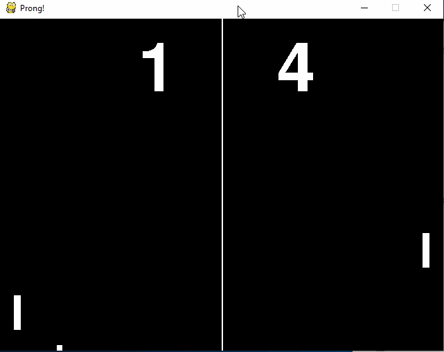

# Prong!
A simple clone of Pong, using Pygame library for Python 3.



# To Run
With python3.x in your $PATH/%PATH% (unix/windows) first create a
virtual environment to install the required packages.

## OS X

Clone from here with git:

```
cd $HOME
git clone https://github.com/crajun/prong.git prong
```

Make sure to use brew installed python, not the system-python shipped with OS X.

To do that, install brew first if you haven't already:

```
/bin/bash -c "$(curl -fsSL https://raw.githubusercontent.com/Homebrew/install/master/install.sh)"
brew install update && brew install python3
```

Now run these commands to create a virtual environment to run Prong inside of, keeping all its
dependencies in one place and isolating it.

```
mkdir $HOME/Envs
cd $HOME/Envs
python3 -m venv prong
source prong/bin/activate
```

Now move to the cloned folder location and then install Prong required dependencies:

```
cd $HOME/prong
pip install -r requirements.txt
```

To run the game:
```
python main.py
```

## Windows (cmd.exe)

You must have 'python.exe' (version 3.x+) on your %PATH%. For this example, we'll assume
you have already cloned the repo to C:\temp\prong using git-bash or similar.

```
cd C:\temp\prong
python -m venv .env
cd .env/Scripts
activate.bat
cd ..
cd ..
pip install -r requirements.txt
python main.py
```